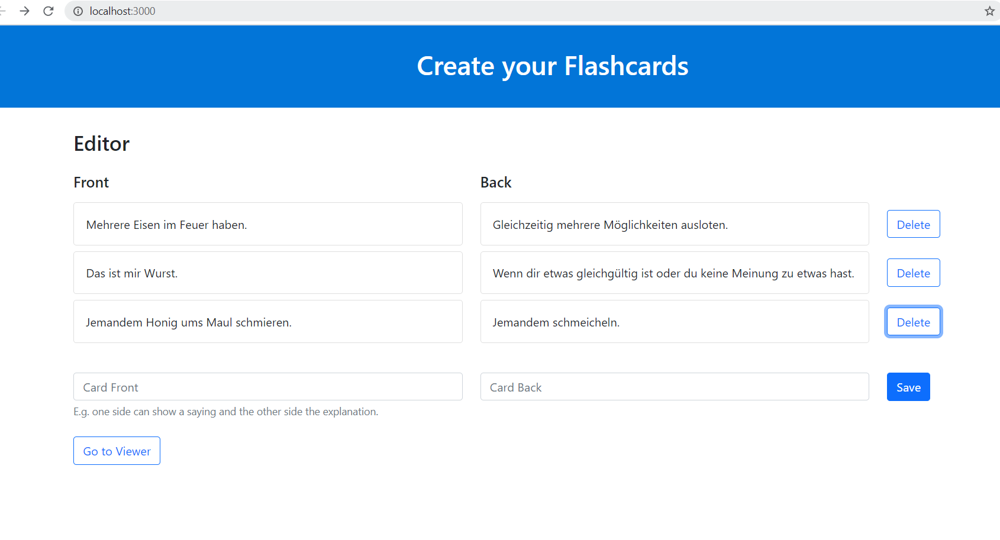
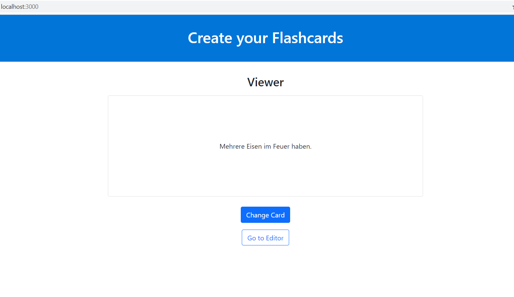

## Flashcards app

React App for editing and viewing custom flashcards.

This project was bootstrapped with [Create React App](https://github.com/facebook/create-react-app).

### To run the app locally

- `npm install`
Installs all dependencies.

- `npm start`
Runs the app in the development mode.\
Open [http://localhost:3000](http://localhost:3000) to view it in the browser.

## Screenshots

